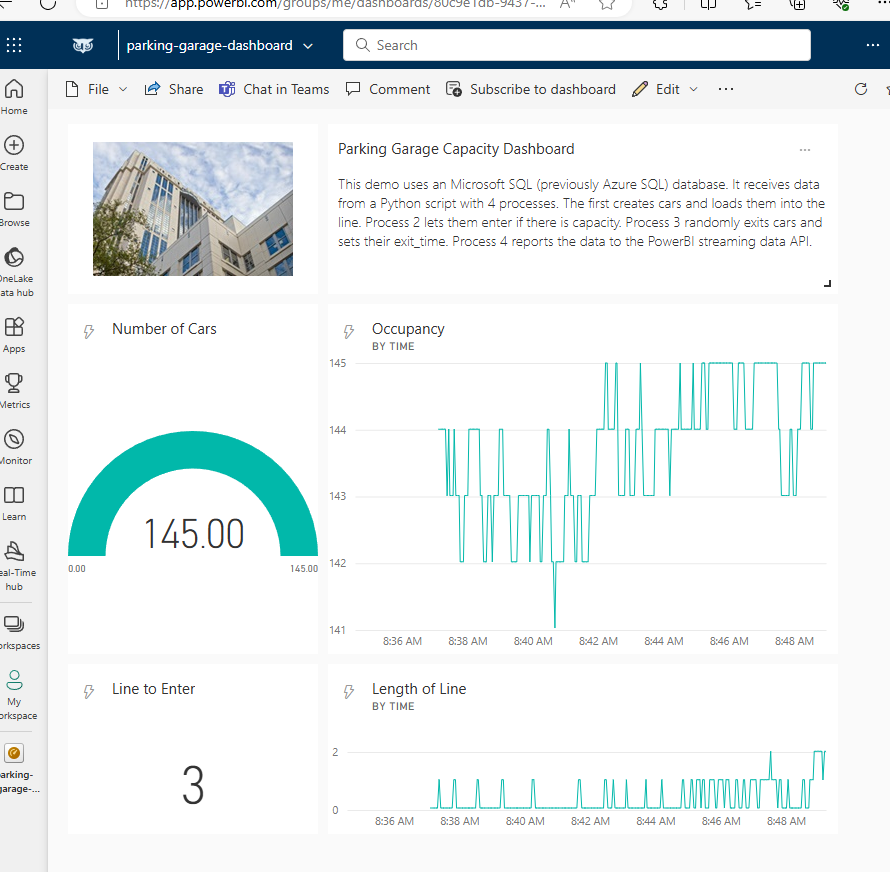
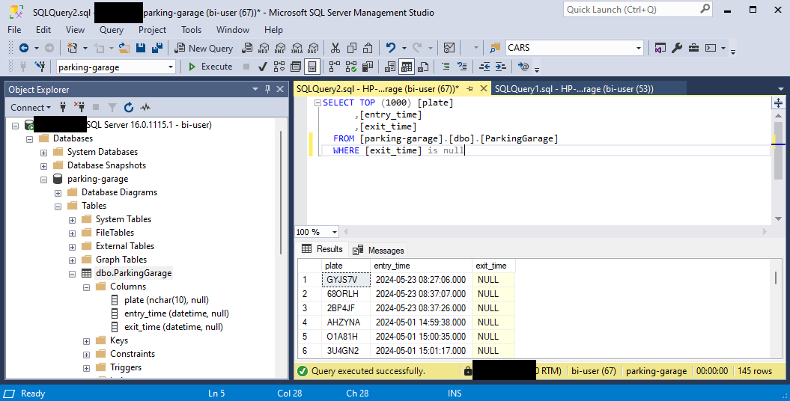

# Parking Garage BI Demo

## Overview
This is a streaming / near real-time Power BI dashboard which shows the current capacity and line to enter a simulated parking garage. The demo previously used a free Azure SQL instance, but due to licensing constraints was moved to an on-premises SQL Server 2022 instance. 

## Architecture
- Microsoft Power BI
    - Tiles: Gauge (Occupancy / Capacity), Line Chart (Occupancy), Card (Number of Cars), Line Chart (Line Length) 
- Microsoft SQL Server 2022
    - Table: `ParkingGarage`: `plate`, `entry_time`, `exit_time`
- Python Script
    - Process 1: Creates cars and adds them to the line to enter the parking garage.
    - Process 2: Allows cars to enter the parking garage, and adds their `plate` and `entry_time` to the DB.
    - Process 3: Allows cars to exit the parking garage, and adds their `exit_time` to the DB.
    - Process 4: Updates the Power BI dashboard (REST + JSON) with the `number_of_cars`, `time`, `capacity-min`, `capacity-max`, and `length_of_line`.

